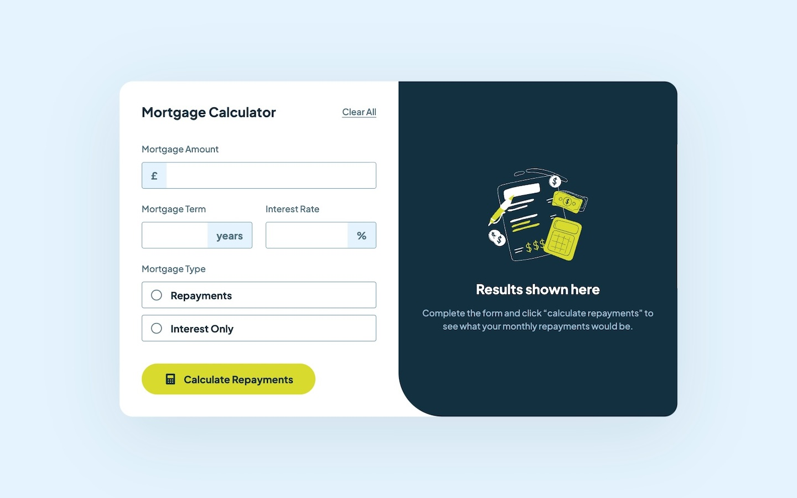
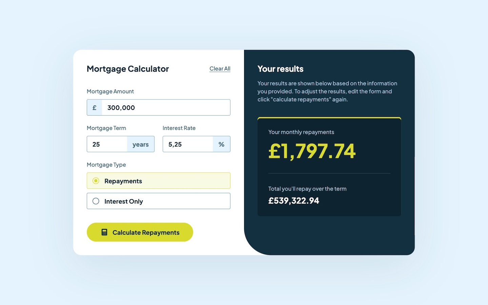

# Frontend Mentor - Mortgage repayment calculator solution

This is a solution to the [Mortgage repayment calculator challenge on Frontend Mentor](https://www.frontendmentor.io/challenges/mortgage-repayment-calculator-Galx1LXK73). Frontend Mentor challenges help you improve your coding skills by building realistic projects.

## Table of contents

- [Overview](#overview)
  - [The challenge](#the-challenge)
  - [Screenshot](#screenshot)
  - [Links](#links)
- [My process](#my-process)
  - [Built with](#built-with)
  - [What I learned](#what-i-learned)
    - [Angular Animations](#angular-animations)
    - [Formatting Mortgage amount](#formatting-mortgage-amount)
    - [Ensure correct input](#ensure-correct-input)
- [Author](#author)

## Overview

### The challenge

Users should be able to:

- Input mortgage information and see monthly repayment and total repayment amounts after submitting the form
- See form validation messages if any field is incomplete
- Complete the form only using their keyboard
- View the optimal layout for the interface depending on their device's screen size
- See hover and focus states for all interactive elements on the page

### Screenshots





### Links

- Solution URL: [https://github.com/FerdinandoGeografo/mortgage-calculator](https://github.com/FerdinandoGeografo/mortgage-calculator)
- Live Site URL: [https://mortgage-calculator-fg.netlify.app/](https://mortgage-calculator-fg.netlify.app/)

## My process

### Built with

- Semantic HTML5 markup
- SASS following 7-1 pattern and BEM conventions
- Flexbox
- CSS Grid
- Desktop-first workflow
- [Angular](https://angular.dev/) - JS Framework

### What I learned

#### Angular Animations

In this frontend mentor challenge I had the opportunity to continue my study on the new features introduced by the Angular framework, in particular I also studied the use of Angular animations to have a smooth transition in the result component.

Thanks to animations based on the app state I was able to add animations based on:

- the presence of the result, in case of form submission;
- absence of the result, in case of initial state or possible subsequent reset.

#### Formatting Mortgage amount

Another tricky use case was the logic for the amount input to format it as a currency, with decimal digits and separators based on locales. For this purpose I've used a valueChanges observable provided by form controls:

```ts
this.form.controls.amount.valueChanges.subscribe((amount) => {
  if (!amount) return;

  const formattedAmount = amount.replace(/\D/g, "").replace(/^0/, "");

  this.form.controls.amount.patchValue(this.#decimalPipe.transform(formattedAmount, "1.0-2", "en-EN"), { emitEvent: false });
});
```

As we can see, the input is treated as text but formatted each time the valueChanges observable emits. The formatting phase includes the usage of Decimal Pipe provided by Angular to format the string with decimals and separators.

#### Ensuring correct input

I followed the same strategy as for term and rate controls, in this case to ensure correct values:

```ts
this.form.controls.term.valueChanges.subscribe((term) => {
  if (!term || term <= 0) this.form.controls.term.patchValue(null, { emitEvent: false });

  if (term && term > 50) this.form.controls.term.patchValue(50, { emitEvent: false });
});

this.form.controls.rate.valueChanges.subscribe((rate) => {
  if (rate === null || rate < 0) this.form.controls.rate.patchValue(null, { emitEvent: false });

  if (rate && rate > 100) this.form.controls.rate.patchValue(100, { emitEvent: false });
});
```

I've assumed this logic:

- The years for the mortgage term can never be more than 50 (I don't know if this is actually the case, but I did some research on the Web).
- The interest rate can never be greater than 100 or less than 0.

## Author

- Frontend Mentor - [@FerdinandoGeografo](https://www.frontendmentor.io/profile/FerdinandoGeografo)
- LinkedIn - [@FerdinandoGeografo](https://www.linkedin.com/in/ferdinandogeografo/)
- GitHub - [@FerdinandoGeografo](https://github.com/FerdinandoGeografo/)
